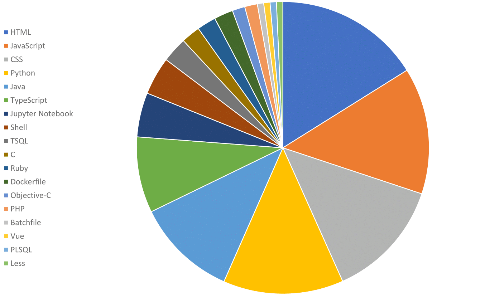

<!--
**AbnerErnaniADSFatec/AbnerErnaniADSFatec** is a ✨ _special_ ✨ repository because its `README.md` (this file) appears on your GitHub profile.

Here are some ideas to get you started:

- 🔭 I’m currently working on ...
- 🌱 I’m currently learning ...
- 👯 I’m looking to collaborate on ...
- 🤔 I’m looking for help with ...
- 💬 Ask me about ...
- 📫 How to reach me: ...
- 😄 Pronouns: ...
- ⚡ Fun fact: ...
-->

# 🔭 Trainee Web Developer, Systems Analysts IT

Currently, I am building a career in technology, specific in the area of ​​web development as a Full Stack Developer, looking for companies with opportunities for projects involving Intelligent Systems, Geographic Information, Image Processing and Data Science.

## 🌱 Educational background

- Graduated in Technology in Analysis and Systems Development, Technology College of São Paulo (FATEC São José dos Campos - Prof. Jessen Vidal) completion at 2020 June.

### Academic

- English Language Course at Education Institution Leader’s School (Particular Level), English Level A2 as result test TOIEC Brigde, conclusion in 2018;
Computer Technician Course at Education Institution Leader’s School (Particular Level), conclusion in 2017.

### Certifications

- MongoDB University Certification - MongoDB Basics for Python Developers Course;
- Oracle University Certification - Database Design and Query Language (SQL);

## Professional background

- SMH - UI Project CPTEC / INPE - development of a system for visualization of climatological data for associated researchers from Jan - Sep / 2019;
- Brazil Data Cube WTSS Project DIDPI / INPE - development of an application programming interface (API) for the return of series in temporal space data for associated researchers with future applications from Nov / 2019;

### Languages and general skills in computer science and programming:

- Expertise in applications with Geographic Information Systems, as well as derivatives of API, Database and Spatial Geometries;
- Expertise in developing REST APIs in Spring Boot;
- Expertise in Python, C and Java programming languages and advanced knowledge in Object Oriented Programming;
- Technical knowledge in hardware and software solutions and assistance;
- Expertise in HTML, CSS, PHP and JavaScript for Web development as back-end;
- Advanced English Language Level, fluent in reading and speaking;
- Multiplatform development with Node, React Native and Angular;

### Most Used Languages

  

### :stars: Personal goals

:hugs:

I want to be part of this institution to acquire knowledge and experience in the job market in the area of Information Technology and enrich my project portfolio.
